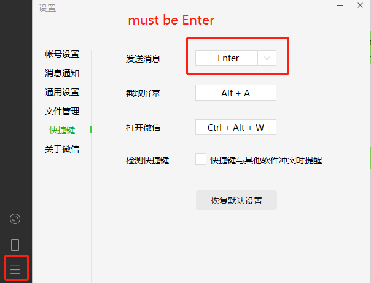

# Wechat Auto-Reply to The designated people 
#### Simple Tutorial
@author : Ye Yuhao 

@Time   : 2023/1/11 21:45

@File   : just for fun

-----------------
## Introduction
In this activity, we wiil utilize the python package of ITCHAT to auto-reply someone's Wechat.

It is recommeded that we use this python script to someone u hate. But, maybe, you should have a deep consideration Think twice. That is to say "Look before you leap". Do not be impulsive and do things immediately, check for the pissible things that might come in you ways.Have a look.

-------------
## Example runs
--------------------
### demo_itchat.py
```python
python itchat.py 
```
**it didn't fininsh for didn't support for the new version of Wechat** . I didn't wanna to fix it, so confused. The following is my solution:
- 1. fix raise ssLerror(e, request-regrequests .exceptions.SSLError: HTTP
```cmd
pip uninstall -y certif
pip install certifi==201
```
- 2. fix xml.parsers.expat.ExpatError: mismatched tag: line 64, column 4
```python
pip install itchat-uos
```
There is stil unsoloved, i guess the Wechat have banned the webbrowser-wechat.
The i change the package of itchat(utili.py)
```python
def print_qr(fileDir):
    if config.OS == 'Darwin':
        subprocess.call(['open', fileDir])
    elif config.OS == 'Linux':
        subprocess.call(['xdg-open', fileDir])
    elif config.OS == "Windows":
        webbrower.open(fileDir)
    else:
        os.startfile(fileDir)
```
也就是说运行itchat的itchat.auto_login(enableCmdQR=1)时，会弹出一个二维码，很明显的是这个二维码是登录的网页版微信，然而网页版微信似乎大多数人都不能用，很久很久之前的微信账号才能用.
### demo_wxauto.py   
**it work!**
usage:
```python
python demo_wxauto.py
```
-----------------------
## Python analysis for the demo_wxauto.py
-----------------------
If you want to change the people and the content you want to send, change this:
```python
mine:
if __name__ == "__main__":
    msg_info = u"请问，您有收到上面几句话了吗？"
    msg_object = u"曹诗林"

you:
if __name__ == "__main__":
    msg_info = u"you content "
    msg_object = u"the username you rename in you wechat account"
```
Pay attention to the "msg_object", it must the same as the notes in your WeChat to that person.

--------------------------
If you want to change the people and the content you want to send, change this:
```python
mine:
    if msg_time == "56":
        WX.ChatWith(msg_object)
        WX.SendMsg(msg_info)
    return 1

you:
    if msg_time == "the minutes you want ":
        WX.ChatWith(msg_object)
        WX.SendMsg(msg_info)
    return 1
```
-------------------------------
If you wechat didn't send out the message, just show in the typing frame. Please check this settiing in your wechat.



## Last 
Have Fun !

@annotation : If have any proplem or somewhat wanna to chat,please feel free to e-maill me

@address    : milesyeyuhao@gmail.com